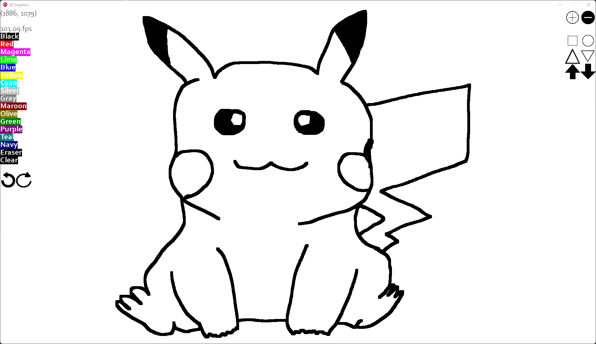
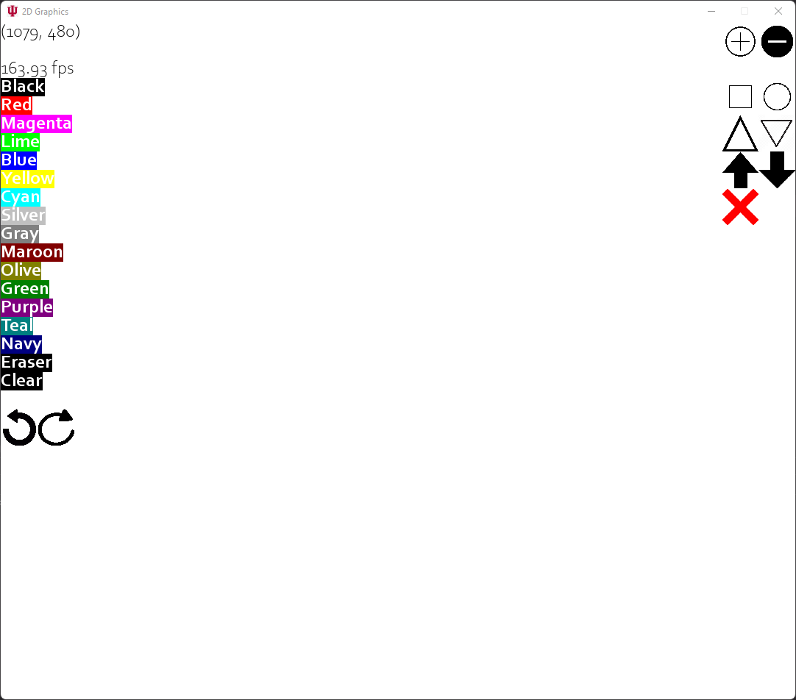
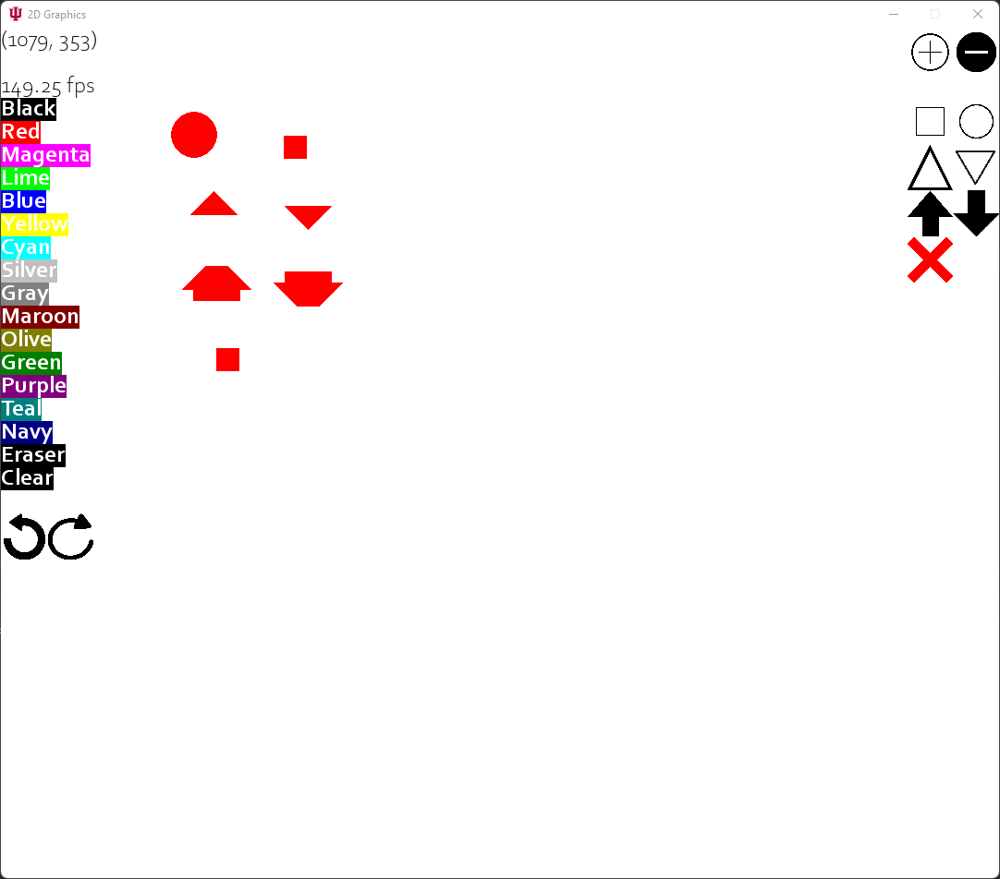

# Basic 2D Graphic Demo (For CSCI-437)

## Features
- Drawing Program
- Select from 16+ Colors (Left)
- Buttons
- Undo and Redo
- Increase or Decrease Drawing Size
- Draw with Shapes (Square, Several Types of Triangles, Polygons, Circles, Several types of Arrows.)
- FPS Counter (Top Left)
- Cursor Position (Top Left)
- Clear entire canvas
- Eraser
- Able to undo a cleared canvas.
- Can deselect from a shape.

## Installation / Local Setup
1) Clone the repository ``git clone https://github.com/MujyKun/basic2dgraphics.git``
2) Go to the repo directory ``cd basic2dgraphics``
3) Installing Python ^3.9 is recommended. 
4) Install requirements with either 
   1) ``pip install -r requirements.txt`` 
      1) If you do not have pip, you can install it with ``python get-pip.py`` or ``python -m ensurepip --upgrade``
   2) If you have poetry you can use ``poetry install``. 
5) Start the program with `python run.py`

### Example Drawing

### Demonstration

### Blank Canvas

### Sample Objects

